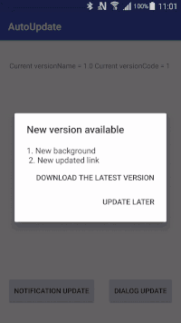

### 🤔 Why an auto updater

Not all android loaded devices get a notification for the android market when a new version of your application is available. If the app targets users from all over the world, updates should not be limited to some specific devices that benefit from the android market.
I had my implementation of this idea a while ago, but I could not find the project, and I also found one by ```https://github.com/feicien/android-auto-update``` that has everything I need for now.
I just brought minor updates to his project, so all credits go to feicien.

### 🔧 How to use it?

- Add the project library to your project
- Include the library (```include ':library'``) by updating your settings.gradle file

```xml
    include ':app',':library'
```
- Add the ```implementation project(':library')``` to your app build gradle

```xml
dependencies {
    ...

    implementation project(':library')
}

```

- You can choose whether to use a dialog of a notification for informing the user about the availability of a new update.

    - To use a Dialog
    ```java
      UpdateChecker.checkForDialog(this);
    ```
    
    - To use a Notification
    ```java
      UpdateChecker.checkForNotification(this);
    ```

- You can update the server address from the class ```Constants``` 

    ```java
      static final String UPDATE_URL
    ```
    

<details>
<summary>THE SOFTWARE IS PROVIDED "AS IS" ...</summary>

```md
THE SOFTWARE IS PROVIDED "AS IS", WITHOUT WARRANTY OF ANY KIND, EXPRESS OR IMPLIED, INCLUDING BUT NOT LIMITED TO THE WARRANTIES OF MERCHANTABILITY, FITNESS FOR A PARTICULAR PURPOSE AND NONINFRINGEMENT. IN NO EVENT SHALL THE AUTHORS OR COPYRIGHT HOLDERS BE LIABLE FOR ANY CLAIM, DAMAGES OR OTHER LIABILITY, WHETHER IN AN ACTION OF CONTRACT, TORT OR OTHERWISE, ARISING FROM, OUT OF OR IN CONNECTION WITH THE SOFTWARE OR THE USE OR OTHER DEALINGS IN THE SOFTWARE.
```

</details>
